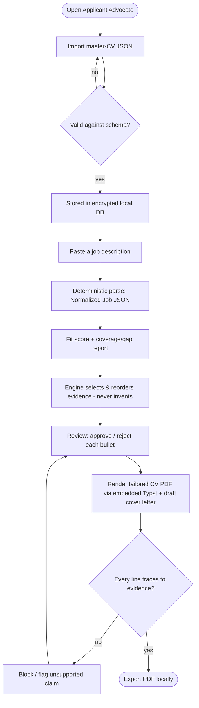

# Applicant Advocate — IDEA dossier

> The human-facing companion to the agent-facing package (`brief.md`, `smu-seed.md`, `first-slice.md`,
> `handoff.md`). One understanding, two faces — they never disagree.

## The opportunity, in a sentence
A **local-first, honest** job-application assistant that turns your master CV into a **tailored CV +
draft cover letter** for any role — every claim proven against your own evidence, nothing leaving your
machine. It **cuts through the noise without gaming the system**.

## Why now / why this (the wedge)
The market splits two ways and leaves a gap in the middle:
- **Cloud ATS-optimisers** (Teal, Rezi, Jobscan, Kickresume, Enhancv) — subscriptions, your data in
  their cloud, optimised for **keyword-gaming**.
- **Thin OSS scripts** (Ollama cover-letter generators, Reactive Resume the builder) — local, but
  single-purpose and rough.

**Applicant Advocate leads with integrity:** it *refuses to fabricate or keyword-stuff*, keeps data
on-device, and makes every claim **click-traceable** to the evidence that backs it (the *evidence
ledger*). The defensible moat is the **combination** nobody has assembled: deterministic fit-scoring +
evidence ledger + typeset PDF quality + **Seek/AU focus** + a path to a full job-application OS.

## Parameter scorecard

| Axis | Verdict | Note |
|---|---|---|
| **A — Problem** | Strong | Per-application tailoring is slow/generic; cloud tools exfiltrate data. |
| **B — Actor** | Focused | AU mid-career tech/knowledge worker (Seek + LinkedIn AU), runs a desktop app. |
| **C — Wedge** | Real, contested | Honest + local + traceable + AU; overlaps Citevault → named risk. |
| **D — Value/price** | Mission ($0) | Free OSS; value = hours saved + privacy + honest output. |
| **E — Buildability** | High | Maps cleanly to FOUNDRY `handler-rust` + `handler-react`; Typst is Rust. |

## Competitive landscape

| Tool | Local? | Honest (no-stuffing)? | Tailoring engine | Output quality | AU/Seek |
|---|---|---|---|---|---|
| Teal / Rezi / Jobscan / Kickresume | ✗ cloud | ✗ ATS-optimise | LLM/keyword | good | US-centric |
| Reactive Resume (OSS) | ✓ self-host | n/a (builder) | ✗ (builder only) | good | — |
| OSS Ollama scripts | ✓ | ~ | LLM one-shot | rough | — |
| **Citevault** | ✓ | ✓ evidence-grounded | ~ | ? | ? |
| **Applicant Advocate** | ✓ | ✓ evidence ledger | ✓ deterministic + (later) LLM | typeset (Typst) | ✓ Seek + LinkedIn AU |

> **Named risk:** Citevault claims nearly the same positioning. We differentiate on the *full stack*
> (deterministic scoring + ledger + typeset PDF + AU focus + job-OS roadmap) and monitor it.

## User-flow — the first slice (the actor's path)



The flow visualises **exactly the first slice** — no capture extension, no LLM, no tracking. What you
confirm here is what FOUNDRY builds.

## Key screen — the coverage & review view (wireframe sketch)

```
┌───────────────────────────────────────────────────────────────────┐
│ Applicant Advocate            [ Senior Backend Engineer · Acme ]    │
├──────────────────────────┬────────────────────────────────────────┤
│ COVERAGE                 │ TAILORED CV  (drag to reorder)          │
│ Must-have   9/11  ▓▓▓▓░  │ ✓ Designed payments service 4M/day  →e12│
│ Nice-to-have 4/8  ▓▓░░░  │ ✓ Cut p99 latency 38%               →e08│
│                          │ ✗ Mentored 4 engineers       [reject]   │
│ GAPS                     │ … reorder · approve/reject …            │
│ • Kubernetes (nice)      │                                         │
│ • Event-driven (must)    │ COVER LETTER (draft, templated)         │
│                          │ "Dear Hiring Team, …"                   │
│ Fit score: 0.82          │                                         │
├──────────────────────────┴────────────────────────────────────────┤
│ Every line shows its evidence id ·  [ Export PDF ]                  │
└───────────────────────────────────────────────────────────────────┘
```

## Rendering note
This dossier is rendered as **structured markdown + Mermaid** (degraded mode). A **design-reviewed
mockup** of the key screen (via atelier `/mockup`) and a **print-quality illustrated PDF dossier**
(via pressroom `/publish`) can be generated on request — they were not auto-run to keep the handoff
moving.
